# Assignment: PostGIS I
## Worth: 40 points
## Due: Thursday, April 18, 11:59pm

## Assignment
## PostGIS


## License

PostGIS is an extension to the open source database, PostgreSQL. PostgreSQL, or “postgres”, is released under a special license called the “PostgreSQL License”:


```
PostgreSQL is released under the PostgreSQL License, a liberal Open Source license, similar to the BSD or MIT licenses.

PostgreSQL Database Management System (formerly known as Postgres, then as Postgres95)

Portions Copyright © 1996-2018, The PostgreSQL Global Development Group

Portions Copyright © 1994, The Regents of the University of California

Permission to use, copy, modify, and distribute this software and its documentation for any purpose, without fee, and without a written agreement is hereby granted, provided that the above copyright notice and this paragraph and the following two paragraphs appear in all copies.
```


PostGIS is released under the GNU General Public License (v2 or later):


```
GNU GENERAL PUBLIC LICENSE
Version 2, June 1991

Copyright (C) 1989, 1991 Free Software Foundation, Inc.
51 Franklin Street, Fifth Floor, Boston, MA 02110-1301 USA

Everyone is permitted to copy and distribute verbatim copies
of this license document, but changing it is not allowed.
```


PostgreSQL has been installed as a service on your workstations and is running on port 5432. 
The PostGIS extension has also been installed. The installation path should be `C:\PostgreSQL\data\pg11`

The administrative username and password are: `postgres/postgres`

The easiest way to start interacting with Postgresql is to open `pgAdmin 4`, a GUI browser 
for exploring postgresql databases, including schemas, tables, views, users, and more. 
It also has a powerful scripting integration for writing simple SQL and/or writing and running 
more complex `PL/PgSQL` scripts.


## pgAdmin


### Add server

Start pgAdmin 4. You will first want to connect to your database, or “Add a server” to this browser. 

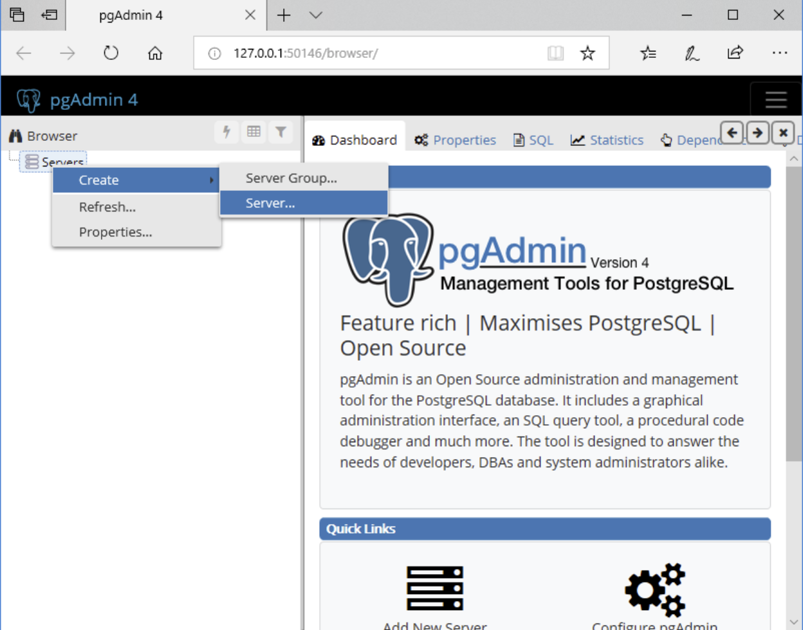

Name it localhost and switch to the “Connection” tab. 

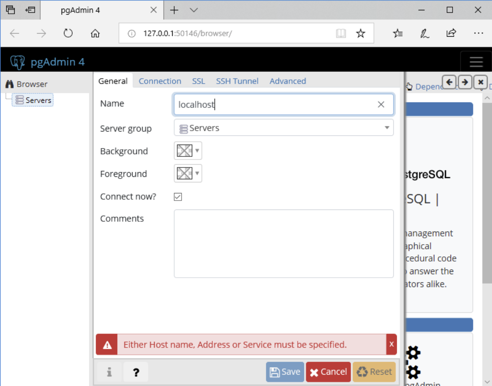

In the connection tab, enter the host as localhost, the port as 5432, and the username and password as postgres and postgres. 

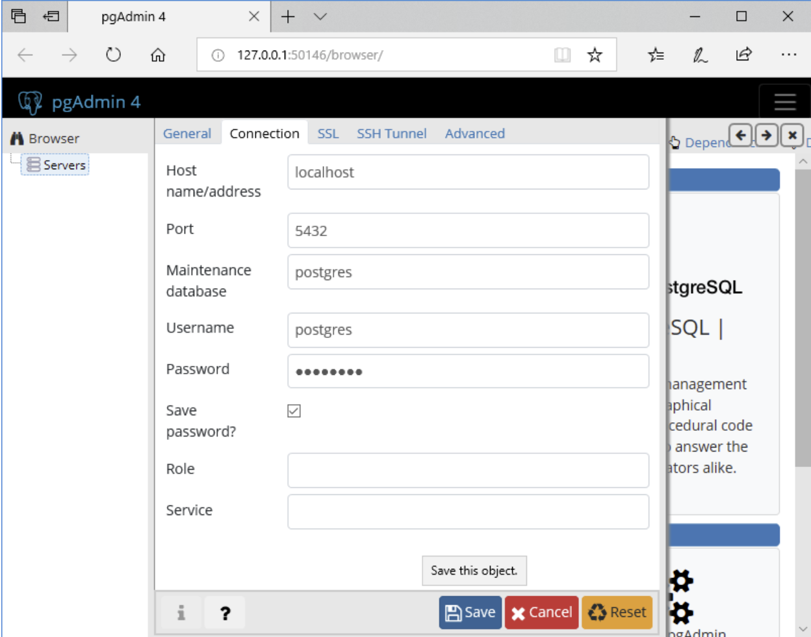

Click Save. Next, create a new database, just for our geospatial stuff.

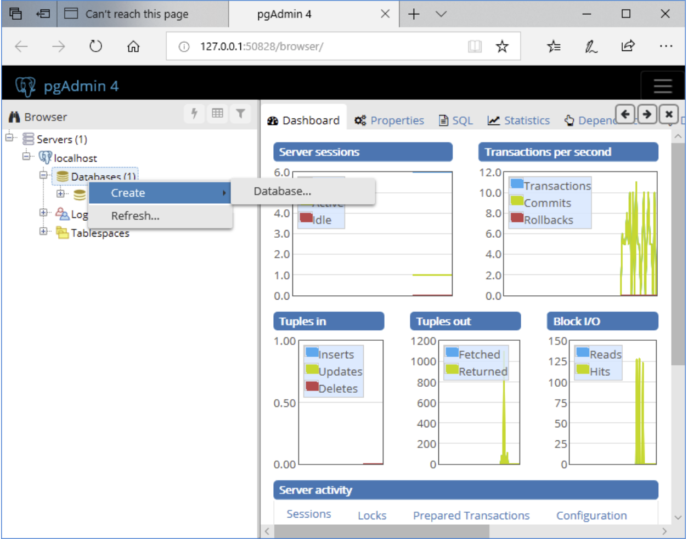

Name it gist604b and Save it.

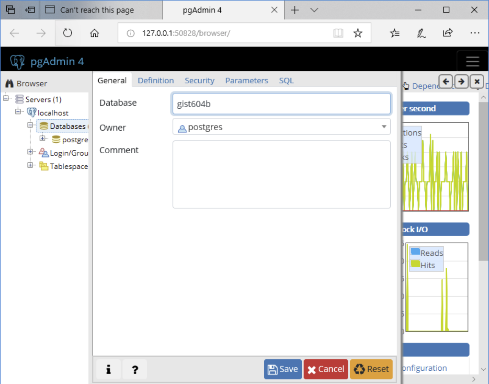

The database will initially be marked with a red “x” because we are not actually connected. Click on the “+” next to your new database to connect to it. Spend a few minutes exploring the database.

### Query tool

Next, open the Query Tool. It is accessible from the lightning icon above the list of Servers in the left-hand pane.

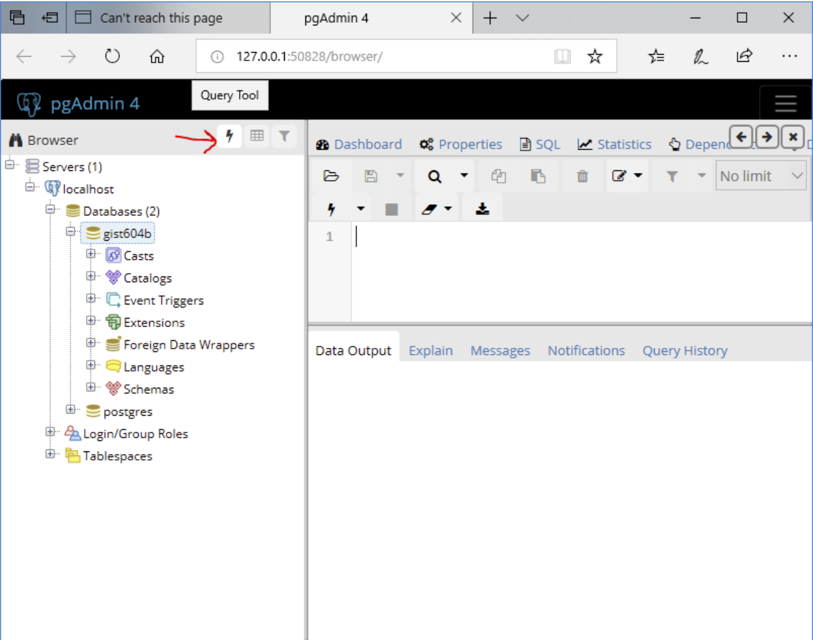

So far the database you created is just a plain old postgresql database without any fancy geospatial capabilities. We need to install the `postgis `extension. In your query tool editor, enter:

```
CREATE EXTENSION postgis;
```

And then click the lightning icon inside the Query Tool to execute the SQL.

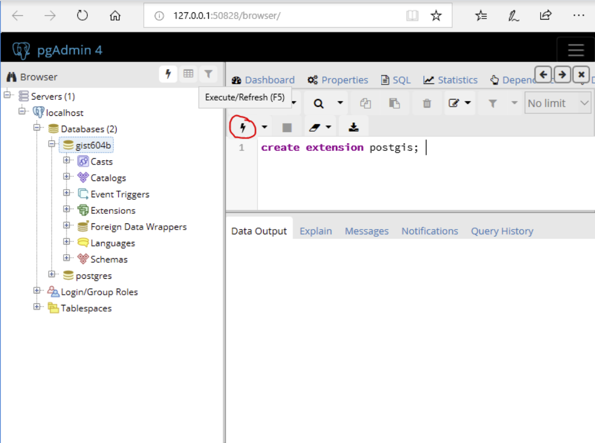

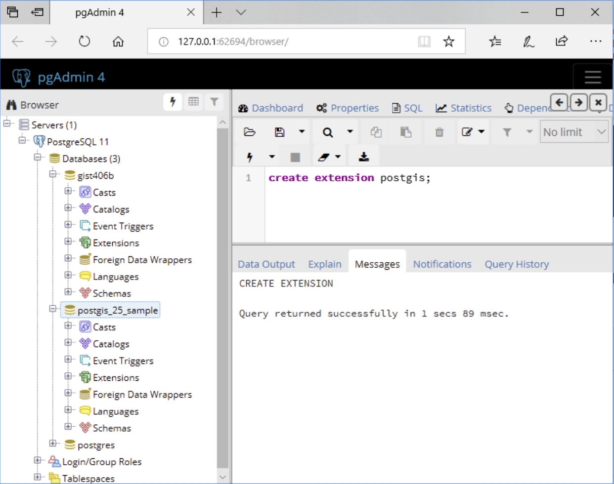

In the SQL editor, enter the following:

```
select postgis_full_version();
```

The result will be in a single cell. If you copy the contents of the cell and paste it in Notepad++ it should look something like this:


```
"POSTGIS="2.5.0 r16836" [EXTENSION] PGSQL="110" GEOS="3.7.0-CAPI-1.11.0 3.7.0" PROJ="Rel. 4.9.3, 15 August 2016" GDAL="GDAL 2.2.4, released 2018/03/19 GDAL_DATA not found" LIBXML="2.7.8" LIBJSON="0.12" LIBPROTOBUF="1.2.1" RASTER"
```


The various properties refer to open source libraries that this PostGIS was built with.


## Load data into PostGIS

_*Note: You may want to save your postgres password. Use your favorite search engine to learn how to save your password as an environment variable or put it in your .pgpass file*_

Download the shapefile for Tucson subdivisions from [http://gisdata.tucsonaz.gov/datasets/subdivisions-open-data](http://gisdata.tucsonaz.gov/datasets/subdivisions-open-data).Extract the zip file to a directory, then open a command window (type `cmd` in the start menu) and `cd` to the directory where it is unzipped. Use the `shp2pgsql` tool to create a SQL file that we can use to import into the database. 


```
shp2pgsql -s 2868 Subdivisions__Open_Data subdivisions > Subdivisions__Open_Data.sql
```


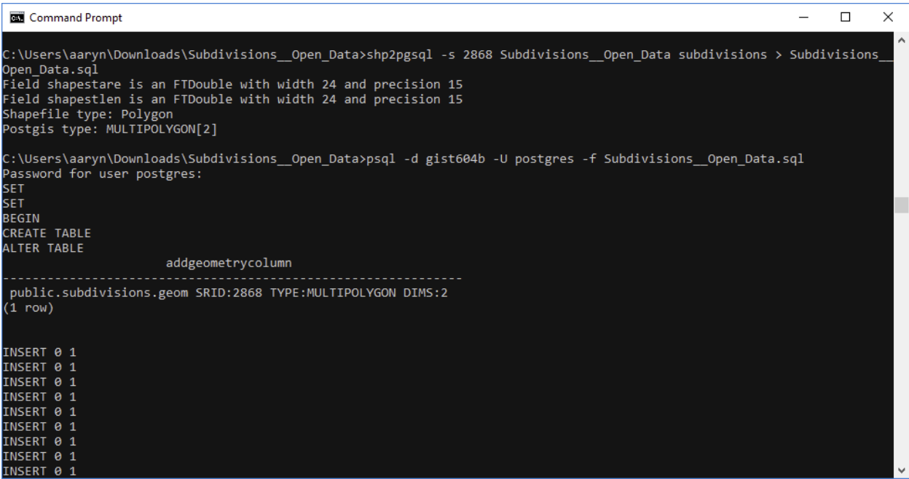


Open the SQL file in Notepad++ and examine it. When you are satisfied, use the psql command line utility to run the script, which will create the table and load the data into the table. 


```
psql -d gist604b -h localhost -U postgres -f Subdivisions__Open_Data.sql
```


Open pgAdmin 4  and look at the table that was just created. 


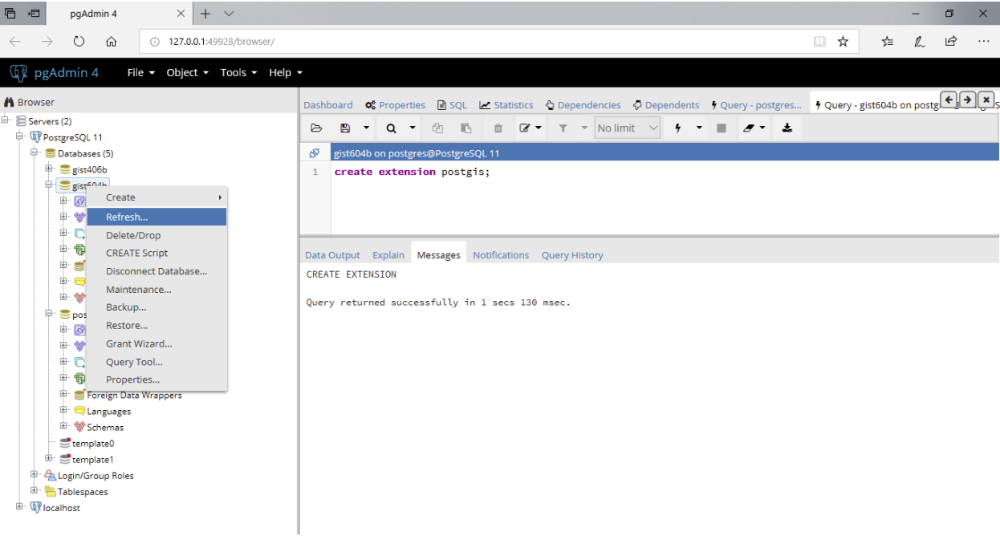


Next, enable the extension for this particular database:


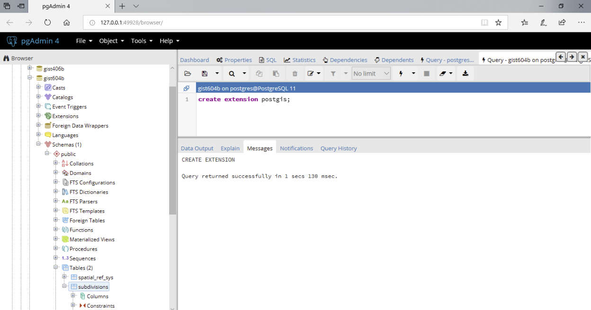


Right click on the table and make the selection to view the first few records in the database. Look at the column names and types. Is this similar to what you saw in the .sql file earlier?


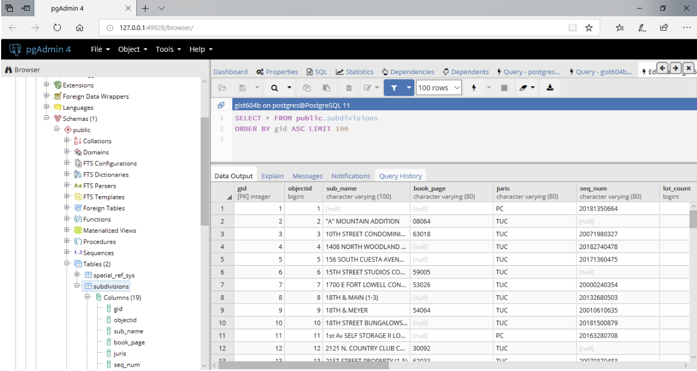


## View in QGIS

Open GGIS and select the “Layer -> Add PostGIS Layers” option. 


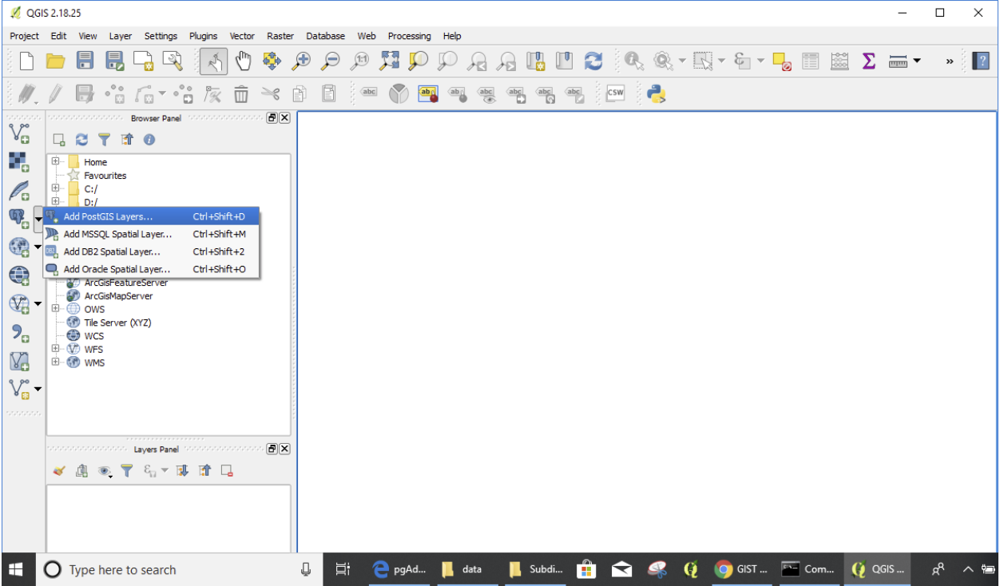


Enter the correct information for your installation, then Test the connection. If ok, click “Ok”


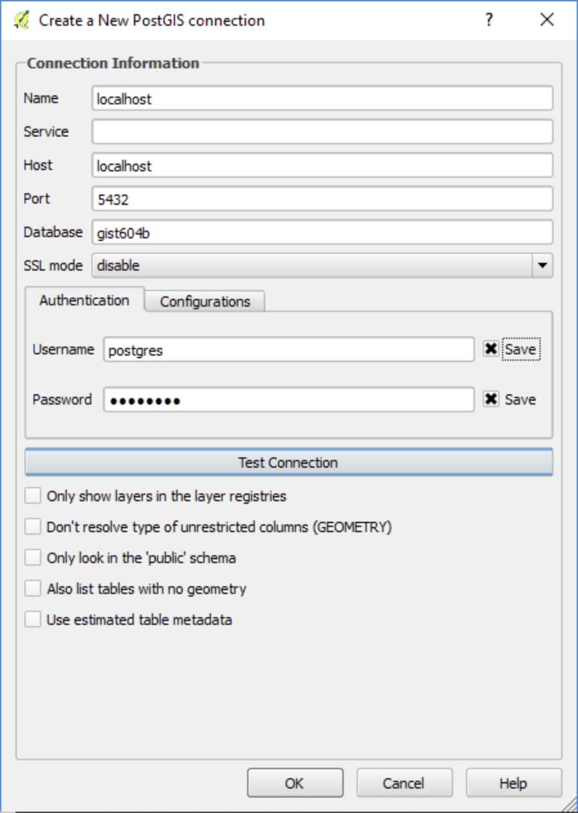


Pick your PostGIS Layer and add it to the map. Interact with the data, changing the symbology and looking at the attribute table.


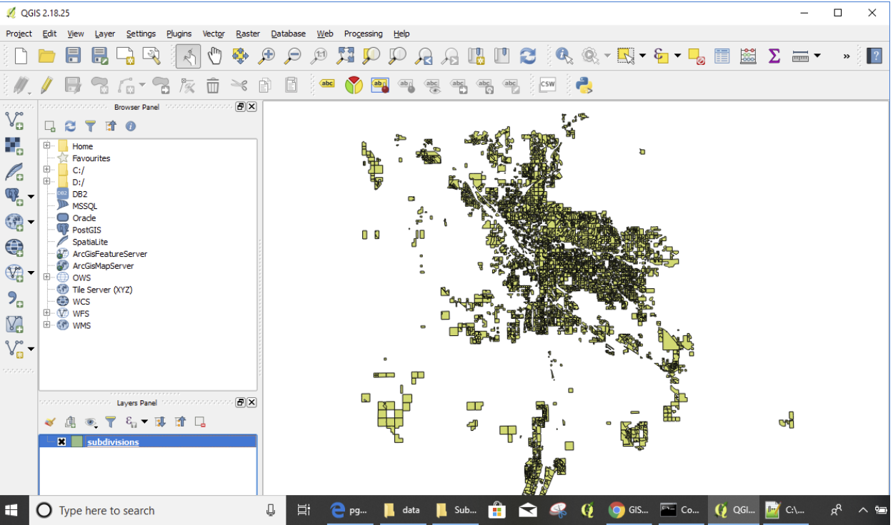


## OpenStreetMap Arizona

Download the Arizona shapefile for OpenStreetMap from [http://download.geofabrik.de/north-america/us/arizona.html](http://download.geofabrik.de/north-america/us/arizona.html).

Unzip and take note of the projection:

GEOGCS["GCS_WGS_1984",DATUM["D_WGS_1984",SPHEROID["WGS_1984",6378137,298.257223563]],PRIMEM["Greenwich",0],UNIT["Degree",0.017453292519943295]]

This is EPSG:4326.

The command to load this data into PostGIS is called shp2psql.


```
shp2pgsql -s 4326 gis_osm_places_free_1 > gis_osm_places_free_1.sql
```


This creates a SQL file that you can use to load the data into postgresql. Loading data via the command line is pretty simple:


```
psql -d gist604b -h localhost -U postgres -f gis_osm_places_free_1.sql
```


There are a lot of files to work with so let’s use this script to run them all in one go:


```
for /F %i in ('dir /B *.shp') do shp2pgsql -s 4326 %i %~ni > %~ni.sql
```


### NOTE ASSIGNMENT DELIVERABLE #1

**Screenshot showing output of the shp2pgsql output or a full list of the commands used**

Look in Windows explorer and confirm the SQL files have been created.


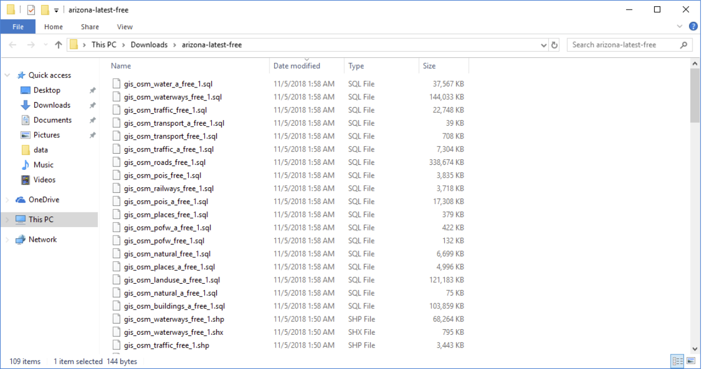


Next, batch create the tables from the .sql files:


```
set PGPASSWORD=postgres

for /F %i in ('dir /B *.sql') do psql -d gist604b -h localhost -U postgres -f %i
```


The commands will look like this:


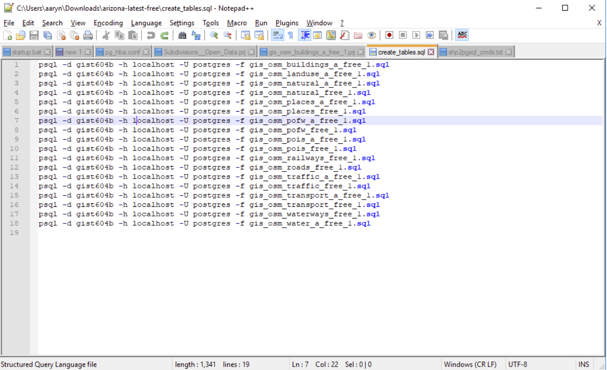


### NOTE ASSIGNMENT DELIVERABLE #2

**Screenshot showing output of the psql output or a full list of the commands used**

The names are pretty obnoxious since they all start with the same 8 characters. To change a table name in SQL: 


```
ALTER TABLE my_table RENAME TO new_name;
```


Use it with psql to run it from the command line:


```
psql -d gist604b -h localhost -U postgres -c "ALTER TABLE gs_osm_buildings_a_free_1 RENAME TO buildings;
```


Do this for all the OSM layers. I didn’t do it for the rest of this tutorial but it will make things a lot easier for you.


### Open PostGIS Tables as Layers in QGIS and Style


#### 

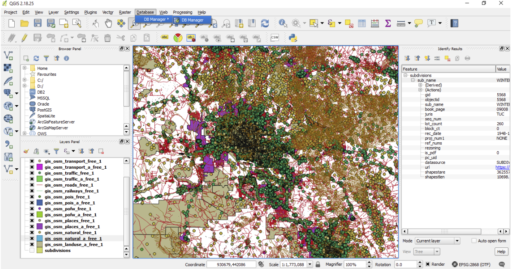


#### Assignment

Open the OSM Arizona layers. Use your expert cartographic skills to customize the styles and create SLDs for each layer. Import the SLDs into geoserver. Create a workspace for the Arizona OSM named “`osm`”. Create layers in the `osm` workspace for each of the OSM tables using a PostGIS DataStore. Apply the appropriate SLDs to each layer. Finally, create a LayerGroup containing the layers. 

The deliverables for the assignment will be:


1. Screenshot showing output of the shp2pgsql output or a full list of the commands used
2. Screenshot showing output of the psql output or a full list of the commands used
3. Screenshot of the PostGIS tables viewed as layers in GQIS
4. Screenshot of geoserver UI showing the list of osm layers
5. Screenshot of a WMS request against the LayerGroup

