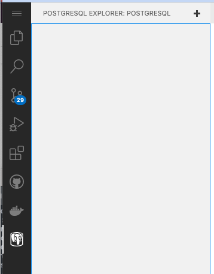
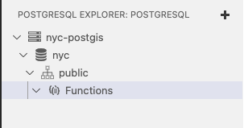
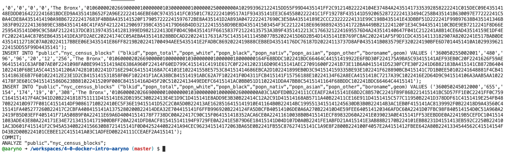
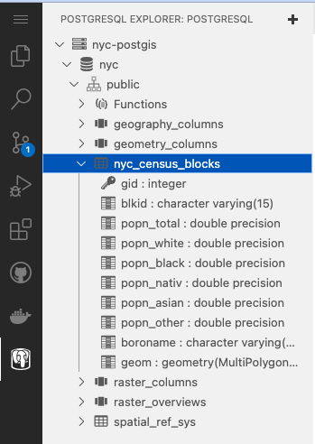
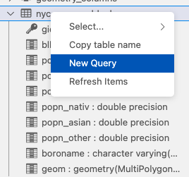
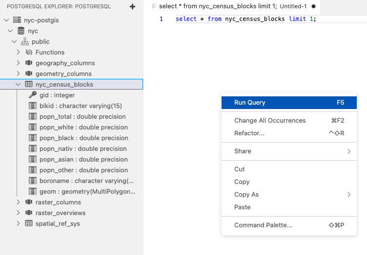
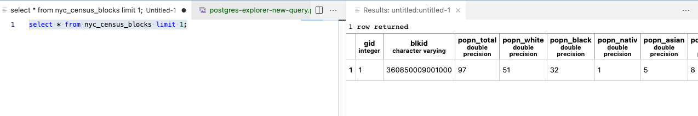

# Introduction to PostGIS

## Deliverables
Create a new branch named `postgis` and submit a `pull request` to merge with master. Your branch should contain answers to the questions in this README in a separate file named 
- `answers.md`

## Background
PostGIS is an extension to the open source database, PostgreSQL. PostgreSQL, or “postgres”, is released under a special license called the “PostgreSQL License”, which is similar to the BSD or MIT license. PostGIS is released under the GNU General Public License (v2 or later). The PostGIS Extension expands the default behavior of PostgreSQL to include `geometry` and `geography` data types and geospatial functionality for interacting with, modifying, transforming, and joining spatial data through spatial functions. 

### Docker
We will be using the `[mdillon/postgis](https://hub.docker.com/r/mdillon/postgis/)` docker container which is built on the official `postgresql` image. You can see the full stack of docker layers for `mdillon/postgis` here: 

[mdillon/postgis Dockerfile layers](https://hub.docker.com/layers/mdillon/postgis/latest/images/sha256-b2a8fefe8a635025ef746db322a030f7f463d63fc7e5c37769793edcd66525a8?context=explore)

And to peel the onion further, the `postgres` image is build as follows:
[postgis Dockerfile layers](https://registry.hub.docker.com/layers/library/postgres/latest/images/sha256-e21150abf83d89aca1b61c8ccc182cc8164da2571a0d8ee0babce8790bed46ab?context=explore)

### Codespaces
The codespace for this assignment has two extensions enabled: `ms-azuretools.vscode-docker` and `ckolkman.vscode-postgres`. 

The extensions are accessed via the left menu bar to the left of the Explorer window, under the Hamburger and look like this:


## Assignment
Follow the tutorials linked below and answer the questions listed in this README.md. These questions are slight variations on the exercise questions listed in the workshop materials. Read carefully and figure out how to answer the question by tweaking the workshop questions.

Copy  your answers into a new file named `answers.md` and commit to a new branch named `postgis`. When you are done, submit a PR to merge with master and send a slack message to the instructor. 

### Start the database
To start the database, find the `Terminal` window in your codespace and enter:

```
docker volume create pg_data
docker run -d -p 5432:5432 --mount type=volume,src=pg_data,target=/var/lib/postgresql/data mdillon/postgis
```

Notice that the port forwarding is between the client (which is your codespace container running in the cloud) and the docker container (which is running in the docker sandbox inside your codespace container running in the cloud). It also creates a volume so you can keep your data if the codespace/docker container restarts

## Create a new "database"

We use the term "database" in too many ways in this course. We have used it to describe software like postgresql, mysql, oracle, etc. But in this case we mean a special database entity called `database`. A `database` in this respect contains a number of `schema`s and within those `schema`s there are `table`s. It gets a lot more complicated than that but generally we have that hierarchy:

- `database` contains 1 or more `schema`s contains 0 or more `table`s

For this assignment we are going to create a `database` to store some spatial and tabular data for New York City and we will work through some tutorials with this data. You may need to wait a minute for the database to start up.

In the Terminal panel, type:
```
psql -c "create database nyc"
```
This will create a new `database` named `nyc`. If you get an error like `error: connection to server at "localhost" (::1), port 5432 failed`, just wait 15 seconds and try again. 

### Connect to your `nyc` database
To connect to the `database` we are going to use the provided VSCode `ckolkman.vscode-postgres` extension. Click on the elephant icon in your left menu bar. 



This will show any postgresql databases you have configured. Of course, you haven't configured any yet! Click on the large "+" icon at the top of this Postgres Explorer panel. You will be directed through a series of 7 dialog boxes. Enter the following:

- (1/7) The hostname of the database
  - `localhost`
- (2/7) The PostgreSQL user to authenticate as
  - `postgres`
- (3/7) The password of the PostgreSQL user
  - `postgres` (will show up as `********`)
- (4/7) The port to connect to
  - `5432`
- (5/7) Use an ssl connection?
  - `Standard Connection`
- (6/7) Which databases to connect to
  - `nyc`
- (7/7) The display name of the database connection
  - `nyc-postgis`
  
  If all goes well, you will see the `postgis` database in the Postgres Explorer panel:
  
  

### Enable PostGIS for your `nyc` database

```
psql -d nyc -c "create extension postgis"
```

### Import shapefile data into your `nyc` database

Data for this assignment is available in the [./data](./data) directory and consists of a set of shapefiles:
- `data/nyc_census_blocks.shp`
- `data/nyc_homicides.shp`
- `data/nyc_neighborhoods.shp`
- `data/nyc_streets.shp` 
- `data/nyc_subway_stations.shp`

We will use a PostGIS utility named `shp2pgsql` to import the shapefiles into your postgis database.

In a `Terminal` window, type the following:
```
shp2pgsql -s 26918 -c -g geom ./data/nyc_census_blocks.shp public.nyc_census_blocks
```
If all goes well you will see something like this:



What just happened? Well, some clues come from the command, which we'll break down into pieces:

- `shp2pgsql` is the command
- `-s 26918` indicates the CRS of the source data
- `-c` indicates that CREATE TABLE statements should be generated
- `-g geom` indicates that the COLUMN containing the geometry should be named `geom`
- `/data/nyc_census_blocks.shp` is the source file
- `public.nyc_census_blocks` is the table we want to create and import this data into.

However, the data has notbeen imported into the table yet. The `shp2pgsql` command only creates the SQL for inserting the data and creating the tables. To actually create the tables and insert the data we need to pipe the output into a command that will execute the SQL in the database.

Note that if the output from the previous command is still scrolling, make sure the `Terminal` window is in focus (i.e., click in the window) and hold `CTRL` and `C` down at the same time. `CTRL-C` will cancel the command.

```
shp2pgsql -s 26918 -c -g geom data/nyc_census_blocks.shp public.nyc_census_blocks | psql -d nyc
```
If all goes well you should see a lot of lines like this:
```
...
INSERT 0 1
INSERT 0 1
INSERT 0 1
...
```

Each line represents a new record being inserted into the `nyc` database.

Validate that the table has been created by looking at your PostgreSQL Explorer. You should see a `nyc_census_blocks` table in the `public` schema:



Great! 

Now do the same thing for the rest of the shapefiles:
```
shp2pgsql -s 26918 -c -g geom data/nyc_census_blocks.shp public.nyc_homicides | psql -d nyc
shp2pgsql -s 26918 -c -g geom data/nyc_neighborhoods.shp public.nyc_neighborhoods | psql -d nyc
shp2pgsql -s 26918 -c -g geom data/nyc_streets.shp public.nyc_streets | psql -d nyc
shp2pgsql -s 26918 -c -g geom data/nyc_subway_stations.shp public.nyc_subway_stations | psql -d nyc
```

### Open a query browser
In Postgresql Explorer, right click on a schema or table and select `New Query`:



This will open a new window in the Editor. Type the following:
```
select * from nyc_census_blocks limit 1;
```
Then right click in the editor window and select `Run Query`:



You will see the Editor panel split into two panels, opening a second panel open to the right with the values of one of the rows of the `nyc_census_blocks` table:



Now that you know how to use the Postgresql Explorer Extension to write and execute SQL queries, let's get on with the assignment!

### Exercises
We are going to follow some exercises from a workshop. The workshop uses a slightly different setup so we are going to jump
past the first few sections. These exercises are basically cookbook recipes to give you good examples for constructing
queries and answering the kinds of spatial questions you want to ask as a GIS professional. In Part 1 of this unit we will 
work our way through Sections 1 through 14, sipping Section 3, since we already installed Postgresql and PostGIS.

Use the Postgresql Explorer "Run Query" window to execute the SQL queries in the tutorials

[http://postgis.net/workshops/postgis-intro/](https://github.com/ua-gist-open-source/postgis-workshops/blob/master/postgis-intro/sources/en/index.rst)

### [1. Welcome](https://postgis.net/workshops/postgis-intro/welcome.html)
### [2. Introduction](https://postgis.net/workshops/postgis-intro/introduction.html)

### [6. About NYC workshop data](https://postgis.net/workshops/postgis-intro/about_data.html)
### [7. Simple SQL](https://postgis.net/workshops/postgis-intro/simple_sql.html)
### [8. Simple SQL Exercises](https://postgis.net/workshops/postgis-intro/simple_sql_exercises.html)

1. What is the *Asian* population of the City of New York?
2. What is the population of *Manhattan*?
3. For each borough, what percentage of the population is *black*?

### [9. Geometries](https://postgis.net/workshops/postgis-intro/geometries.html)
### [10. Geometry Exercises](https://postgis.net/workshops/postgis-intro/geometries_exercises.html)

4. What is the area of the *‘New Brighton’* neighborhood?
5. What is the area of the *Bronx* in acres?
6. How many census blocks in New York City *DO NOT* have a hole in them?
7. What is the total length of streets (in *MILES*) in New York City?
8. How long is ‘5th Ave’?
9. What is the JSON representation of the boundary of ‘Soho’?
10. How many polygons are in the ‘Coney Island’ multipolygon?
11. What are the 5 longest roads in NYC?

### [11. Spatial Relationships](https://postgis.net/workshops/postgis-intro/spatial_relationships.html)
### [12. Spatial Relationships Exercises](https://postgis.net/workshops/postgis-intro/spatial_relationships_exercises.html)
12. What is the geometry value for the street named ‘S Oxford St’?
13. What neighborhood and borough is S Oxford St in?
14. What streets does S Oxford St join with?
15. Approximately how many people live on (within 50 meters of) S Oxford St?

### [13. Spatial Joins](https://postgis.net/workshops/postgis-intro/joins.html)
### [14. Spatial Joins Exercises](https://postgis.net/workshops/postgis-intro/joins_exercises.html)
16. What subway stations are in ‘East Village’? What subway route is it on?
17. What are all the neighborhoods served by the 4-train?
18. How many people live in the Financial District'
19. What are the population densities (people / km^2) of the ‘East Village’ and ‘West Village?

